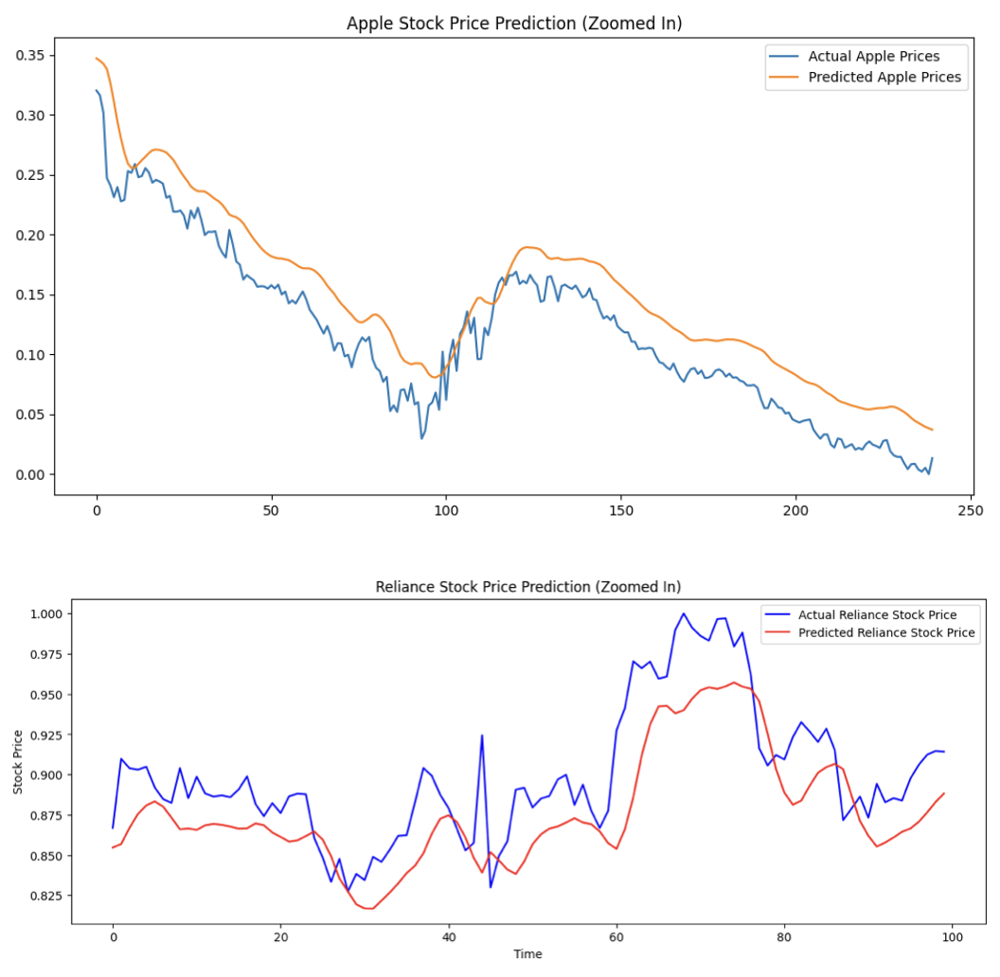

# Stock Price Prediction Using LSTM  

## Introduction  
This project predicts the stock prices of **Apple Inc. (AAPL)** and **Reliance Industries Ltd. (RELIANCE)** using a **Long Short-Term Memory (LSTM)** model. LSTMs, a type of RNN, effectively capture time-series dependencies for financial forecasting.  

## Dataset  
- **Source:** Yahoo Finance API  
- **Period:** 5 years (22.08.2022 - 22.08.2024)  
- **Features:** `Open`, `High`, `Low`, `Close` (target), `Volume`  

## Preprocessing  
- **Cleaning:** Removed missing values & outliers  
- **Normalization:** MinMaxScaler (scales `Close` prices to [0,1])  
- **Sequence Creation:** 60-day window for predictions  

## Model Architecture  
Built with **TensorFlow & Keras**:  
- **LSTM Layers:** 2 layers (50 units each) with Dropout  
- **Dense Layer:** Outputs stock price  
- **Optimizer:** Adam  
- **Loss Function:** MSE  
- **Training:** 100 epochs, validation split used  

## Evaluation  
- **Metric:** RMSE  
- **Results:**  
  - **Apple Model:** RMSE = `0.0341`  
  - **Reliance Model:** RMSE = `0.0268`  
- **Visualization:** Predicted vs. actual stock prices  

## Results  

The graph below compares the actual vs. predicted stock prices for **Apple (AAPL)** and **Reliance (RELIANCE)**.

## Challenges  
- Data quality & handling market volatility  
- Optimizing hyperparameters & model tuning  
- Interpreting RMSE in a dynamic market  

## Potential Improvements  
- Adding **technical indicators** (e.g., Moving Averages, RSI)  
- Exploring **Bidirectional LSTMs & GRUs**  
- Fine-tuning hyperparameters via **grid search**  
- Implementing **ensemble models** for better accuracy  
- Deploying for **real-time prediction**  

## Conclusion  
This project demonstrates **LSTM-based stock price prediction**, with potential for further enhancements to improve accuracy and real-world usability.  
